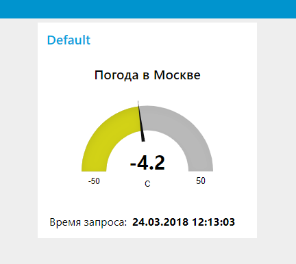

# MSKWeather #

Simple node-red app on docker. Shows weather in Moscow. Values refresh every 5 minutes.  

Image available at [https://hub.docker.com/r/m1khrapunov/mskweather](https://hub.docker.com/r/m1khrapunov/mskweather)

